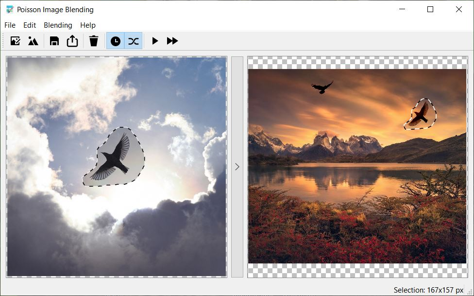

# Poisson Image Editing - Graphical User Interface

This directory contains a Qt-based project implementing a GUI for Poisson image blending.

The program is capable of blending selected areas from multiple source images into one destination image.

It implements the seamless composition algorithm described in the reference paper [P. Prez, M. Gangnet, and A. Blake] using the method of simple gradients and mixed gradients (configurable).

Solving systems of equations is done using the library of the [Eigen](https://gitlab.com/libeigen/eigen "Eigen") project. The implementation is multithreaded to reduce computation times for large images.

